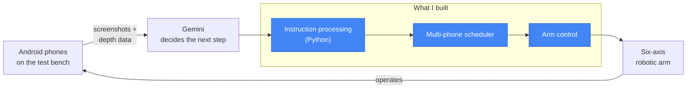

  
  
  

I build systems that have to work outside a demo: AI that drives real hardware, simulation services that need to be fast, and web apps that stay up.

---

## Google · Software Engineering Intern, AI & Robotics

Shanghai · Jun – Aug 2026 · internal project, code not public

I worked on AI-guided testing of Android apps on **physical phones**. Instead of scripted emulators, a **six-axis robotic arm** operates real devices, and **Gemini** decides what to do next by looking at phone screenshots together with depth data from the test bench.

- **Instruction processing (Python):** turned Gemini's guidance into concrete, executable steps for the arm.
- **Dynamic multi-phone scheduling:** kept several physical devices busy on one bench by assigning and sequencing test work across them.
- **Arm control:** connected those steps to the six-axis arm so it could operate the phones.

---

## Projects

| Project | What it does | Highlights |
| --- | --- | --- |
| **[Lifetime Financial Planner](https://github.com/kalvinliang965/ABCD-LFP)** | Full-stack Monte Carlo retirement planner · React/TypeScript, Express, MongoDB | Moved simulations into a worker pool with a queue and recovery: a 2,000-run batch went from **32 s to 9 s** |
| **[Events Around](https://events-around-demo.onrender.com/)** | Live event search · React/Vite, Express/TypeScript, Ticketmaster Discovery API, MongoDB | Redeployed as a single free-tier service with keyless geocoding · 41 API + 31 frontend unit tests |
| **[BERT Attention Visualizer](https://bert-attention-visualizer.vercel.app/)** · [source](https://github.com/Team-Lasso/bert-attention-visualizer) | Compare attention across BERT variants and explore masked-word predictions | Used in a linguistics course with **300+ students** |
| **[This Good Comedy](https://www.thisgoodcomedy.com/en/)** | Bilingual Astro site and GEO for a comedy company | Two non-brand Chinese queries reached **#2 on Google** within three weeks |

Events Around runs on a free instance that sleeps when idle, so the first load can take about a minute.

## Experience & education

| When | Where | Role |
| --- | --- | --- |
| 2026.06 – 2026.08 | **Google** | Software Engineering Intern, AI & Robotics · Shanghai |
| 2026.03 – now | This Good Comedy | Technical Lead, Web Platform & GEO · Los Angeles |
| 2026.01 – now | USC Chinese Graduate Student Association | Co-Technical Lead · six-person team, ~1,000 monthly active users |
| 2024.06 – 2024.07 | Apexus Tech | Data Analysis Intern |
| 2025 – 2027 | University of Southern California | M.S. Computer Science |
| 2020 – 2025 | Stony Brook University | B.S. Computer Science |

## Tools

  

<b>中文简介 · 点击展开</b>

 

我是朱琛，南加州大学计算机科学硕士在读，预计 2027 年 5 月毕业，意向上海、深圳、北京、杭州、广州的软件开发岗位。

**Google · 软件工程实习生（AI 与机器人方向，上海）**：参与 Android 真机自动化测试系统。Gemini 根据手机截图和深度信息判断下一步操作，引导六轴机械臂在实体手机上执行测试。我负责 Python 指令处理、多手机动态调度和机械臂控制。

**项目**：[财务规划平台](https://github.com/kalvinliang965/ABCD-LFP)（蒙特卡洛模拟迁入 worker pool，2,000 次模拟由 32 秒缩短到 9 秒）、已上线的 [Events Around 活动搜索网站](https://events-around-demo.onrender.com/)、用于 300 多名学生课程的 [BERT 注意力可视化工具](https://bert-attention-visualizer.vercel.app/)，以及[这个好喜剧](https://www.thisgoodcomedy.com/zh/)的双语网站与 GEO。

完整经历见[双语作品集](https://chenzhu50.github.io/portfolio/)。

