<p align="center"><b>English</b> &nbsp;|&nbsp; <a href="https://github.com/ChenZhu50/ChenZhu50/blob/master/README.zh-CN.md">中文</a></p>

<div align="center">

<picture><source media="(prefers-color-scheme: dark)" srcset="assets/header-dark.svg"><source media="(prefers-color-scheme: light)" srcset="assets/header-light.svg"></picture>

<p>
  <a href="https://chenzhu50.github.io/portfolio/"></a>
  <a href="https://www.linkedin.com/in/chenzhu50"></a>
  <a href="mailto:czhu1175@usc.edu"></a>
</p>

</div>

I like software that has to survive the real world: real hardware, real traffic, and real users who never read the docs.

### At Google, I taught a robot arm to test phones

On the AI & Robotics team in Shanghai, I worked on a system where a **Gemini** agent reads a phone's screen, a **depth camera** shows where things are, and a **six-axis robotic arm** taps its way through real test cases on physical Android devices.

My part was everything in between. I calibrated the camera to the arm, got the arm to center on a target in the frame, and made each tap land precisely without pressing too hard on the screen. I also owned the Python backend that turns Gemini's instructions into arm commands and schedules the work across several phones. By the end, the prototype had been refactored to Google's engineering standards and landed in the monorepo.

Along the way, a teammate and I built a Gemini tool on the side and **won an internal AI hackathon, first out of 30 teams**.

### Now

I'm finishing an **M.S. in Computer Science at USC** (May 2027). Outside class, I lead the web platform for [This Good Comedy](https://www.thisgoodcomedy.com/en/), a bilingual comedy company in LA, and co-lead a six-person team building the USC Chinese Graduate Student Association's site for about 1,000 monthly users.

### Things I've built

<p align="center">
  <a href="https://events-around-demo.onrender.com/"><picture><source media="(prefers-color-scheme: dark)" srcset="assets/card-events-around-dark.svg"><source media="(prefers-color-scheme: light)" srcset="assets/card-events-around-light.svg"></picture></a>
  <a href="https://github.com/kalvinliang965/ABCD-LFP"><picture><source media="(prefers-color-scheme: dark)" srcset="assets/card-financial-planner-dark.svg"><source media="(prefers-color-scheme: light)" srcset="assets/card-financial-planner-light.svg"></picture></a>
  <a href="https://bert-attention-visualizer.vercel.app/"><picture><source media="(prefers-color-scheme: dark)" srcset="assets/card-bert-visualizer-dark.svg"><source media="(prefers-color-scheme: light)" srcset="assets/card-bert-visualizer-light.svg"></picture></a>
  <a href="https://www.thisgoodcomedy.com/en/"><picture><source media="(prefers-color-scheme: dark)" srcset="assets/card-this-good-comedy-dark.svg"><source media="(prefers-color-scheme: light)" srcset="assets/card-this-good-comedy-light.svg"></picture></a>
</p>

<sub>Events Around runs on a free instance that sleeps when idle, so the first load can take about a minute.</sub>

### Where I spend my time

```text
AI on real hardware
├── Vision-guided control with depth cameras
├── LLM agents that take actions (Gemini)
└── Python services that sit next to hardware

Backend & systems
├── Concurrency: worker pools, job queues, scheduling
├── REST APIs on MongoDB and PostgreSQL
└── Linux, Nginx, HTTPS on a self-managed VPS

Shipping products
├── React + TypeScript on the web, Kotlin on Android
├── Deploying on free tiers: Render, GitHub Pages, Vercel
└── Tests before calling it done
```

<p align="center">
  
</p>

### What's next

I'm looking for software engineering roles after graduation in 2027, open to opportunities in China and internationally. The [portfolio](https://chenzhu50.github.io/portfolio/) has the full story, or just [say hi](mailto:czhu1175@usc.edu).
