<p align="center"><a href="https://github.com/ChenZhu50">English</a> &nbsp;|&nbsp; <b>中文</b></p>

<div align="center">

<picture><source media="(prefers-color-scheme: dark)" srcset="assets/header-dark-zh.svg"><source media="(prefers-color-scheme: light)" srcset="assets/header-light-zh.svg"></picture>

<p>
  <a href="https://chenzhu50.github.io/portfolio/"></a>
  <a href="https://www.linkedin.com/in/chenzhu50"></a>
  <a href="mailto:czhu1175@usc.edu"></a>
</p>

</div>

我喜欢做那种要在真实世界里跑起来的软件：真的硬件、真的流量、真的不看说明书的用户。

### 在 Google，我教会了一只机械臂测手机

在上海的 AI 与机器人团队，我参与的系统里，**Gemini** 智能体看懂手机屏幕，**深度摄像头**告诉机械臂东西在哪，**六轴机械臂**在实体 Android 手机上一步步点完测试用例。

我负责中间的部分：把摄像头和机械臂标定到一起，让机械臂对准画面里的目标，让每一次点击既准又不会压坏屏幕。我还负责 Python 后端，把 Gemini 的指令变成机械臂动作，并在多台手机之间调度任务。实习结束时，原型已经按 Google 的工程规范重构，并合入了主代码库。

期间，我和一位队友用业余时间做了一个 Gemini 小工具，**在内部 AI 黑客松 30 支队伍中拿了第一**。

### 现在

我在**南加州大学读计算机科学硕士**，2027 年 5 月毕业。课外，我负责洛杉矶双语喜剧团体[这个好喜剧](https://www.thisgoodcomedy.com/zh/)的网站，并和六人团队一起为 USC 中国研究生会搭建每月约 1,000 人使用的平台。

### 做过的东西

<p align="center">
  <a href="https://events-around-demo.onrender.com/"><picture><source media="(prefers-color-scheme: dark)" srcset="assets/card-events-around-dark-zh.svg"><source media="(prefers-color-scheme: light)" srcset="assets/card-events-around-light-zh.svg"></picture></a>
  <a href="https://github.com/kalvinliang965/ABCD-LFP"><picture><source media="(prefers-color-scheme: dark)" srcset="assets/card-financial-planner-dark-zh.svg"><source media="(prefers-color-scheme: light)" srcset="assets/card-financial-planner-light-zh.svg"></picture></a>
  <a href="https://bert-attention-visualizer.vercel.app/"><picture><source media="(prefers-color-scheme: dark)" srcset="assets/card-bert-visualizer-dark-zh.svg"><source media="(prefers-color-scheme: light)" srcset="assets/card-bert-visualizer-light-zh.svg"></picture></a>
  <a href="https://www.thisgoodcomedy.com/zh/"><picture><source media="(prefers-color-scheme: dark)" srcset="assets/card-this-good-comedy-dark-zh.svg"><source media="(prefers-color-scheme: light)" srcset="assets/card-this-good-comedy-light-zh.svg"></picture></a>
</p>

<sub>Events Around 部署在免费实例上，闲置后会休眠，首次打开可能要等一分钟左右。</sub>

### 我的时间花在哪

```text
让 AI 驱动真实硬件
├── 基于深度摄像头的视觉引导控制
├── 能执行动作的 LLM 智能体（Gemini）
└── 贴着硬件运行的 Python 服务

后端与系统
├── 并发：worker pool、任务队列、调度
├── 基于 MongoDB 和 PostgreSQL 的 REST API
└── Linux、Nginx、HTTPS，自己管理的 VPS

把产品做上线
├── Web 用 React + TypeScript，Android 用 Kotlin
├── 用免费额度部署：Render、GitHub Pages、Vercel
└── 测试通过了才算完成
```

<p align="center">
  
</p>

### 接下来

我在寻找 2027 年毕业后的软件开发岗位，国内外的机会都欢迎。完整经历见[双语作品集](https://chenzhu50.github.io/portfolio/)，也欢迎直接[发邮件](mailto:czhu1175@usc.edu)。
